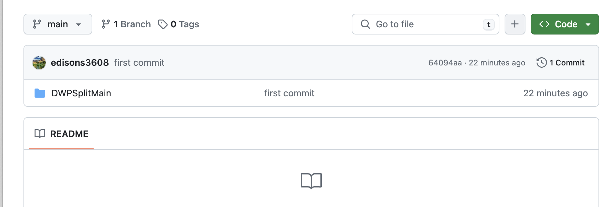

# Advanced DWP View Split

DWPSplit is a Google Chrome extension designed to increase usability of Instruction Manager and DWP 2.0 for Mathnasium instructors.

## Installations

### 1. Click the green "Code" button.

### 2. Click the "Download ZIP"

### 3. Unzip the package
### 4. In Google Chrome, navigate to [Chrome Extensions](chrome://extensions/)
### 5. Click on "Load unpacked" and upload the DWPSplitMain folder when prompted.

### 6. Pin the Chrome Extension to the menu bar

## Usage

Sign into Radius and navigate to the Instruction Manager. Click on the DWPSplitMain shortcut in the Chrome menu bar. The page should split into two sections.

Here's a quick demo:
[Video](https://drive.google.com/file/d/14jWAWSf5oERAVNisELBcZxCDDsS30uhO/view?usp=sharing)

